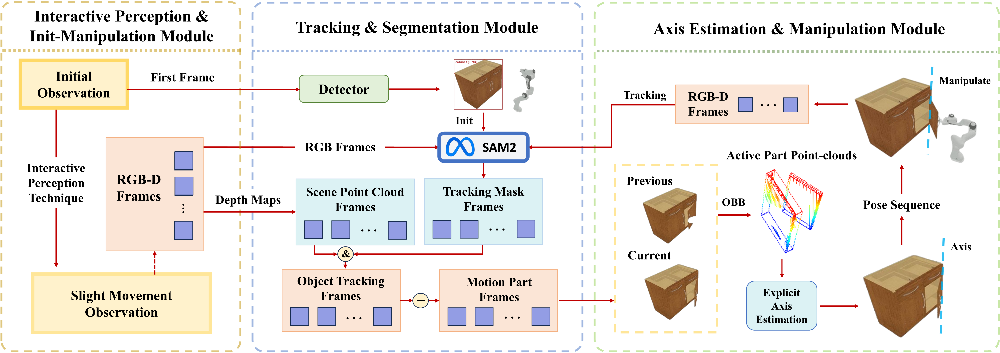

# [Articulated Object Manipulation using Online Axis Estimation with SAM2-Based Tracking](https://tianxingchen.github.io/video-tracking-for-axis-estimation/)

[Xi Wang](https://hytidel.github.io/)\*, [Tianxing Chen](https://tianxingchen.github.io/)\*, Qiaojun Yu, Tianling Xu, Zanxin Chen, Yiting Fu, Cewu Lu†, [Yao Mu](https://yaomarkmu.github.io/)†, [Ping Luo](http://luoping.me/)†

[Project Page](https://hytidel.github.io/video-tracking-for-axis-estimation/) | [Paper](?) | [arXiv](?) | [Video](https://www.bilibili.com/video/BV1dysSepEMD) | [Code](https://github.com/TianxingChen/VideoTracking-For-AxisEst)


# Overview


# 💻 Installation

😀The installation is tested with NVIDIA Driver `550.90.07` , CUDA `12.1` and `setuptools==74.0.0` in Ubuntu `20.04.6 LTS`. 

🧐**Please strictly follow the guidance to avoid any potential errors.** 


[1] Clone our repository from Github by HTTPS: 

```shell
git clone https://github.com/TianxingChen/VideoTracking-For-AxisEst.git
```

​	or SSH: 

```shell
git clone git@github.com:TianxingChen/VideoTracking-For-AxisEst.git
```

[2] Create a conda virtual environment with Python 3.10. 

```shell
conda create -n RGBManip python=3.10
```

[3] Install versions of `torch` and `torchvision` compatible with your CUDA version. Here we install `torch==2.3.1` and `torchvision==0.18.1` for example. 

```shell
pip install torch==2.3.1 torchvision==0.18.1
```

[4] Downgrade your pip version to `pip==24.0` . 

```shell
python -m pip install pip==24.0
```

[5] Install the dependencies. 

```shell
pip install -r requirements.txt
```

[6] Check the environment variable `CUDA_HOME` is set by using: 

```shell
echo $CUDA_HOME
```

​	If it print nothing, it means that you haven't set up the path. 

​	Run this so the environment variable will be set under the current shell. 

```shell
export CUDA_HOME=/path/to/cuda
```

​	If you want to set  the environment variable `CUDA_HOME` permanently, run: 

```shell
echo 'export CUDA_HOME=/path/to/cuda' >> ~/.bashrc
source ~/.bashrc
echo $CUDA_HOME
```

​	Don't know where your CUDA is? Find it by running: 

```shell
which nvcc
```

[7] Install GroundingDINO. 

```shell
cd utils/submodules/GroundingDINO
pip install -e .
cd ../../..
```

[6] Install SAM2. 

```shell
cd utils/submodules/SAM2
pip install -e .
cd ../../..
```

[7] Verify whether your `numpy==1.23.5` .

```shell
pip show numpy
```

​	If not, correct it. 

```shell
pip install numpy==1.23.5
```

# 🏞️ Dataset \& Checkpoints

## Automated Downloading

😍Run the script `install.sh` to automate downloading. 

```shell
./scripts/install.sh
```

Don't forget to check whether the script has executable permission. If not, grant it by running: 

```shell
chmod +x ./scripts/install.sh
```

## Manual Downloading

🥸You can also manually download them following these steps: 

[1] Download dataset and checkpoints of RGBManip. 

```shell
mkdir downloads
mkdir downloads/dataset
mkdir downloads/pose_estimator
mkdir downloads/global_scheduling_policy
```

​	Download the dataset  from [google drive](https://drive.google.com/file/d/154g8SzGFWOcLLjes40aTXFoREX47-ZPk/view?usp=sharing) and decompress it into `downloads/dataset` . 

​	Download the checkpoints `one_door_cabinet.pth` and `one_drawer_cabinet.pth` for Pose Estimator from [google drive](https://drive.google.com/drive/folders/1WshZaRVllWxHfUFK1--e1hQd_64dAKMz?usp=sharing) and move them into `downloads/pose_estimator/<name>.pth` .

​	Download the checkpoints `Cabinet_0.pt` and `Drawer_0.pt` for Global Scheduling Policy from [google drive](https://drive.google.com/drive/folders/1YMI38jeLkPJQa_HJ-RnbQV36zPk4_OvH?usp=sharing) and save them into `downloads/global_sheduling_policy/<name>_0.pt`. Notice that the `_0` is necessary. 

[2] Download the checkpoint of GroundingDINO. 

```shell
mkdir utils/submodules/GroundingDINO/weights
wget -q https://github.com/IDEA-Research/GroundingDINO/releases/download/v0.1.0-alpha/groundingdino_swint_ogc.pth utils/submodules/GroundingDINO/weights/groundingdino_swint_ogc.pth
```

[3] Download the checkpoint of SAM2. 

```shell
wget -q https://dl.fbaipublicfiles.com/segment_anything_2/072824/sam2_hiera_large.pt utils/submodules/SAM2/checkpoints/sam2_hiera_large.pt
```

## File sizes

* The dataset of RGBManip: 530 MB 
* The checkpoints for Pose Estimator of RGBManip: 94.9 MB (`one_door_cabinet.pth`) + 94.9 MB (`one_drawer_cabinet.pth`). 
* The checkpoints for Global Scheduling Policy of RGBManip: 149.9 KB (`Cabinet_0.pt`) + 149.8 KB (`Drawer_0.pt`). 
* The checkpoint of GroundingDINO: 662 MB (`groundingdino_swint_ogc.pth`). 
* The checkpoint of SAM2: 856.4 MB (`sam2_hiera_large.pt`). 

# 📚 Config

😇Here are some instructions for using the config. 

[1] In `cfg/config.yaml` : 

* `headless` determines whether to display the visual rendering in SAPIEN. 

[2] In `cfg/train/test.yaml` : 

* `total_round` refers to the number of times the experiment is repeated **during a single execution of the program**. 
* `skip_no_mask` indicates whether to save the YAML file of the experiment when RGBManip fails to detect the mask of the handle. This setting is related to the calculation of success rates. 
* `save_video` specifies whether to save a video of the manipulation process. For more details, refer to the **Usage** section. 

[3] In `cfg/manipulation/open_cabinet.yaml` and `cfg/manipulation/open_drawer.yaml` : 

* `axis_prediction` indicates whether to guide the manipulation process using the estimated axis. Set it to `False` if you want to use the original policy in RGBManip. 
* `once_SAM2` determines whether to perform the SAM2-based axis prediction only once. Set it to `False` if you want to use our online axis estimation refinement policy. 

[4] In `cfg/task/open_cabinet.yaml` and `cfg/task/open_drawer.yaml` : 

* `save_dir` is a dictionary which contains the paths for saving intermediate results. 
* `save_cfg` is a dictionary that specifies what to save, the observation collection interval and the starting simulation time step. 

# 🛠️ Usage

## Basic Usage

😄We provided some scripts for you to run the specified tasks conveniently. 

* `scripts/open_door_train.sh` : Run door-opening tasks on the RGBManip training set. 
* `scripts/open_door_test.sh` : Run door-opening tasks on the RGBManip testing set. 
* `scripts/open_drawer_train.sh` : Run drawer-opening tasks on the RGBManip training set. 
* `scripts/open_drawer_test.sh` : Run drawer-opening tasks on the RGBManip testing set. 

The format is `./scripts/open_?_?.sh gpu_id num_round` , where `gpu_id` specifies which GPU you would like this script to run on (if you have multi-GPU). Remind that GPU indexing starts from `0` . `num_round` indicates the number of times `python train.py ...` is repeated. Note that it's different from the `total_round` specified in `cfg/train/test.yaml` . If not explicitly specify a value for `num_round` , the scripts will default to executing `python train.py ...` once. 

For example, I can run the drawer-opening tasks on the RGBManip testing set for 5 times on GPU - 0 by using: 

```shell
./scripts/open_drawer_test.sh 0 5
```

## Advanced Usage

😎For advanced players, follow the instruction of [README.md from RGBManip](https://github.com/hyperplane-lab/RGBManip/blob/main/README.md) to manually run a `python train.py ...` - like command, which provides greater operability and flexibility. 

It's worth nothing that the `task.num_envs` parameter here specifies the number of parallel environments during a single execution of the program. This is distinct from the `num_round` parameter in Basic Usage and the `total_round` parameter in `cfg/train/test.yaml` . Increasing `task.num_envs` will significantly raise VRAM usage, especially when using our online axis estimation refinement, which requires multiple iterations of SAM2 tracking. Additionally, increasing `task.num_envs` may lead to multi-process timeout issues. If you encounter such problems, try reducing `task.num_envs` . 

## Save Intermediate Results

😶‍🌫️If you want to save the intermediate results of our pipeline, such as images, tracking images, scene point clouds, masked point clouds, active part point clouds, OBBs and YAMLs, just set the corresponding boolean variables under `save_cfg` in `cfg/task/open_?.yaml` to `True` . All the results will be saved in the `tmp` directory, categorized by tasks, with each task distinguished by `timestamp_{parallel_env_id}` . 

## Generate Visualization

😋We provided a script to conveniently generate videos for visualization. The function of this script is to run the tasks `open_door_train` , `open_door_test` , `open_drawer_train` and `open_drawer_test` each for `num_video` times. You can use it by running `./scripts/generate_videos.sh gpu_id num_video` .  

For example, 

```shell
./scripts/generate_videos.sh 1 3
```

means run each task for 3 times on GPU - 1. 

Before using it, you need to set `save_video` to `True` in `cfg/train/test.yaml` . By default, you will only get a video of the entire manipulation process in the task-specific directory under `tmp/image` . If you want to obtain a visualization video with axis estimation, you can set `self.obs_num_variety` to `2` in the `__init__()` function of the `BaseManipulationEnv` class in `env/sapien_envs/base_manipulation.py` . This will provide both the original manipulation video and a visualization video with axis estimation for the entire process. 

If you just want to see the video of the object being continuously tracked by SAM2 during the manipulation process, simply set `save_tracking_image` to `True` under `save_cfg` in `cfg/task/open_?.yaml` . This video will be saved in the task-specific directory under `tmp/tracking_image` . 

A reminder: for video generation, it's not necessary to set `headless: False` in `cfg/config.yaml` , i.e., you can generate videos in headless mode. 

## Draw Plot

🤯We provided scripts to conveniently calculate success rates and plot line charts. 

Firstly, run `cd calculator` to switch to the directory of the provided tool. 

Next, run `cal.py -p path/to/YAMLs` , which will calculate the success rates of the door-opening or drawer-opening tasks at different amplitudes based on the YAMLs in the `path/to/YAMLs` . The task type will be determined by the path, and you can specify whether the experimental results belong to the training set or the testing set using the `-t` option. If `-t` is not provided, the default is testing set. Additionally, there is an optional `-s` flag, which skips YAMLs with names ending in "\_skipped". These YAMLs are produced by failed axis predictions, which may occur when the initial manipulation amplitude of the object is too small. 

Finally, run `python draw_plot.py` , which will read the results stored in `result_yamls/open_door_success_rate.yaml` and `result_yamls/open_drawer_success_rate.yaml` by `cal.py` . It will plot the success rate as a function of the manipulation amplitude and save the line charts as `imgs/open_door_merged_success_rate.jpg` and `imgs/open_drawer_merged_success_rate.jpg` . 

# 🙏 Acknowledgement

Our code is built upon [RGBManip](https://github.com/hyperplane-lab/RGBManip), [GroundingDINO](https://github.com/IDEA-Research/GroundingDINO), [SAM2](https://github.com/facebookresearch/segment-anything-2). We would like to thank the authors for their excellent works. 


# 🥰 Citation
If you find our work helpful, please consider citing: 

```
@article{wang2024articulatedobjectmanipulationusingonlineaxisestimationwithsam2basedtracking,
      title={Articulated Object Manipulation using Online Axis Estimation with SAM2-Based Tracking}, 
      author={Xi Wang and Tianxing Chen and Qiaojun Yu and Zanxin Chen and Tianling Xu and Yiting Fu and Cewu Lu and Yao Mu and Ping Luo},
      journal={?},
      year={2024}
}
```

# 🏷️ License
This repository is released under the Apache-2.0 license.
